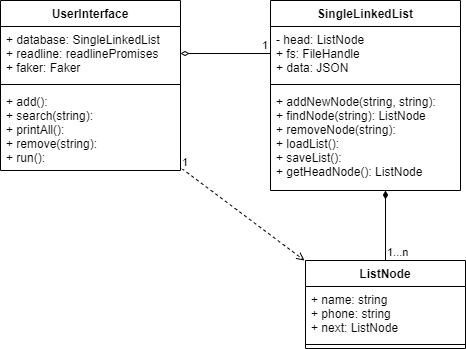
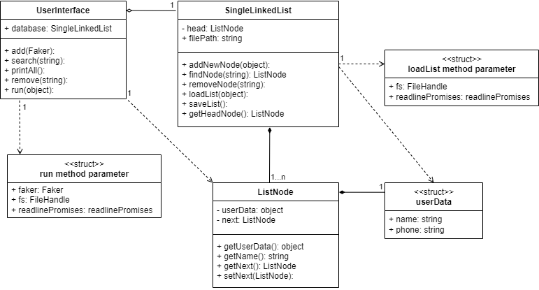
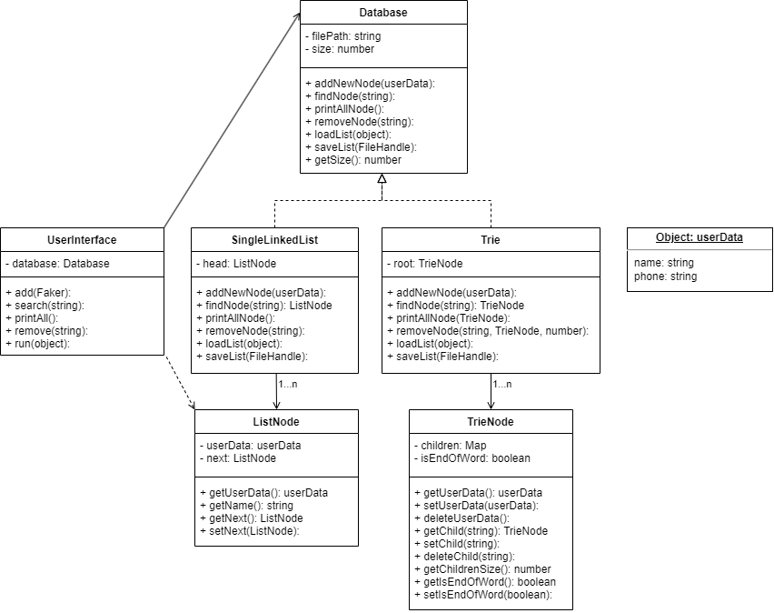

# Object Oriented PhoneBook

> **NOTE:**
>
> 본 과정은 [널널한 개발자 TV. 객체지향 프로그래밍과 디자인 패턴](https://www.youtube.com/playlist?list=PLXvgR_grOs1CTu1t6_0C40SEF61Vv08s5) 영상에서 제안하는 과제 수행을 기반합니다.

## 클래스 다이어그램

- 객체 자체로 작동할 수 있다면, 대상과 Aggregation 관계를 맺습니다.
- 객체 자체로 작동할 수 없다면, 대상과 Composition 관계를 맺습니다.
- 객체 메소드가 실행되는 동안만 대상과 연관이 있다면, Dependency 관계를 맺습니다.

### 1단계: 객체화

### 2단계: 캡슐화 강화

### 3단계: 추상체 분리

