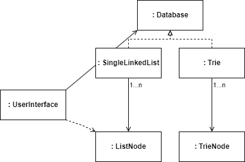
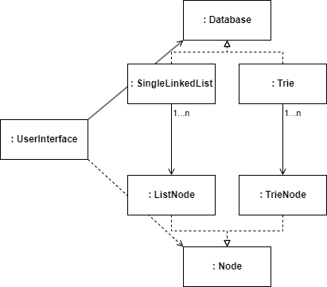

# Object Oriented PhoneBook

> **NOTE:**
>
> 본 과정은 [널널한 개발자 TV. 객체지향 프로그래밍과 디자인 패턴](https://www.youtube.com/playlist?list=PLXvgR_grOs1CTu1t6_0C40SEF61Vv08s5) 영상에서 제안하는 과제 수행을 기반합니다.

## 개선 과정

1. [객체화](https://github.com/yongki150/object-oriented-phone-book/commit/da9dff5a6d60350d4fcad0f435f02d50ebd5020a)
2. [캡슐화 강화](https://github.com/yongki150/object-oriented-phone-book/commit/ea2643c766df1736f705dae229ef244e425b557a)
3. [추상체 분리](https://github.com/yongki150/object-oriented-phone-book/commit/4bb57f3f384e7ea66c4ebab73bf81eeb9cb81d5c)

## 다이어그램

> **NOTE: JavaScript 버전**
>
> - 런타임 시, 자식 노드 객체가 결정됩니다.
>
> https://github.com/yongki150/object-oriented-phone-book

> **NOTE: TypeScript 버전**
>
> - 컴파일 시, 자료구조 타입을 통해 자식 노드 타입을 알 수 있습니다.
> - 런타임 시, JavaScript와 동일합니다.
>
> https://github.com/yongki150/object-oriented-phone-book/tree/ts

